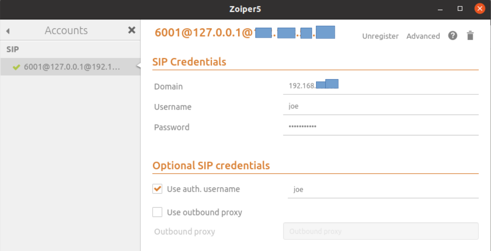

# Twilio-Asterisk
Asterisk SIP Trunking

Install Asterisk asterisk-certified-16.8-current.tar.gz

1. Follow instructions to set up Asterisk

- https://wiki.asterisk.org/wiki/display/AST/Installing+Asterisk
- or YouTube Tutorial
https://www.youtube.com/watch?v=jMQfSsO1da4&list=PLnzEbgyK52Gu9fdVDHburrsG3KBIntXFK&index=1

This was recorded in 2015 and most examples are based in chan_sip has been deprecated, but still a good tutorial to get the sense of setting up Asterisk.
Examples in this file are using chan_pjsip.

2. Zoiper 5 is used for this project
Download Zoiper5_5.5.5_x86_64.tar.xz from
https://www.zoiper.com/en/voip-softphone/download/current

Setup zopier with user name and login 

3. Setup Twilio SIP trunk in Twilio account following instructions:

https://www.twilio.com/docs/documents/61/TwilioElasticSIPTrunking-AsteriskPBX-Configuration-Guide-Version2-1-FINAL-09012018.pdf

Noted that using SIP registration simplified the setup without firewall setting as the Asterisk setup above. 

See asterisk setup.docx for configuration files.
